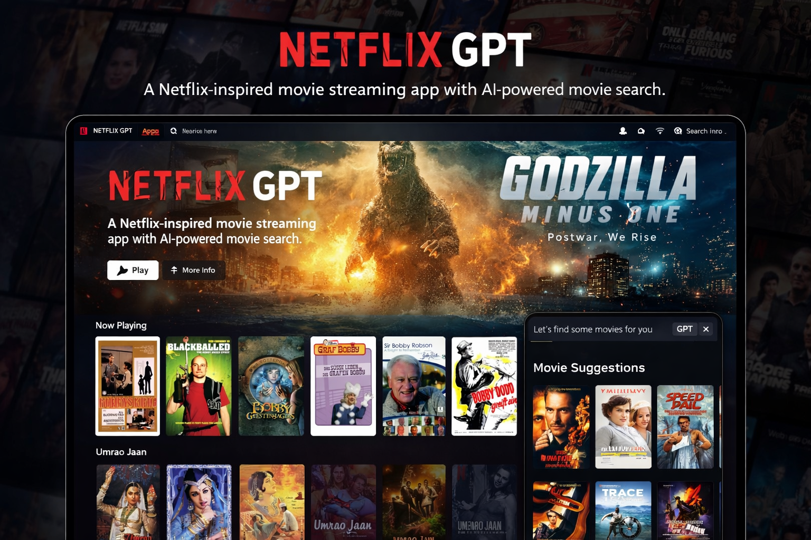

  <h1 align="center">🎬 Netflix GPT</h1>
  

    A Netflix-inspired movie suggestion platform powered by <b>GPT-based AI search</b>, built using React, Redux, Firebase, Tailwind CSS, and TMDB APIs.
  

  

---

## 🚀 Tech Stack

- ⚛️ React (Create React App)
- 🎨 Tailwind CSS
- 🗂️ Redux Toolkit
- 🔐 Firebase Authentication
- 🎥 TMDB API
- 🤖 OpenAI API (GPT Search)
- 🌐 React Router

---

## ✨ Features

### 🔑 Login / Sign Up
- Firebase Authentication
- Sign In / Sign Up Forms
- Form Validation using `useRef`
- Redirect to Browse Page after login
- Protected Routes (Auth Guard)

### 🏠 Browse Page (After Authentication)
- Header with User Profile
- Main Movie Section
  - Trailer in background (Autoplay + Mute)
  - Movie Title & Description
- Movie Suggestions
  - Multiple Movie Lists
  - Reusable Movie Card Components

### 🤖 NetflixGPT (AI Search)
- GPT-powered Movie Search Bar
- Multi-language Support 🌍
- AI-generated movie suggestions
- TMDB-based recommendations
- Visually appealing suggestions layout

---

## 🛠️ What I Built (Step-by-Step)

### 🔐 Authentication & User Management
- Firebase setup & deployment
- Create Sign Up user account
- Implement Sign In API
- Redux store with `userSlice`
- Sign Out & Update Profile
- Bug Fixes:
  - Display name & profile picture update
  - Redirect logic for authenticated / unauthenticated users
- Proper cleanup using `onAuthStateChanged` unsubscribe

---

### 🎥 Movies & UI
- Centralized constants file
- Registered TMDB API & generated access token
- Fetch:
  - Now Playing Movies
  - Popular Movies
- Custom Hooks:
  - `useNowPlayingMovies`
  - `usePopularMovies`
- Created `movieSlice`
- Planned Main & Secondary Containers
- Embedded YouTube trailer videos
- Used TMDB Image CDN
- Fully styled using Tailwind CSS

---

### 🤖 GPT Integration
- GPT Search Page & Search Bar
- OpenAI API integration
- GPT Search API calls
- Fetch GPT movie suggestions from TMDB
- Created `gptSlice`
- Reused Movie List component
- Optimized using Memoization

---

### ⚙️ Production & Deployment
- Environment variables using `.env`
- Secured API keys
- Added `.env` to `.gitignore`
- Fully responsive design 📱💻
- Deployed to production 🚀

---

